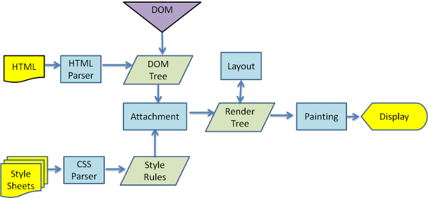

# 浏览器的工作原理

### 浏览器的高层结构

- 用户界面
    包括地址栏、前进/后退按钮、书签菜单等。除了浏览器主窗口显示的您请求的页面外，其他显示的各个部分都属于用户界面

- 浏览器引擎
    在用户界面和呈现引擎之间传送指令

- 呈现引擎
    负责显示请求的内容

- 网络
    用于网络调用，比如 HTTP 请求；其接口与平台无关，并为所有平台提供底层实现

- 用户界面后端
    用于绘制基本的窗口小部件，比如组合框和窗口。其公开了与平台无关的通用接口，而在底层使用操作系统的用户界面方法

- JS解释器
    用于解析和执行 JavaScript 代码

- 数据存储
    持久层。浏览器需要在硬盘上保存各种数据，例如 Cookie

**Chrome 浏览器的每个标签页都分别对应一个呈现引擎实例。每个标签页都是一个独立的进程**

### 呈现流程

webkit

gecko

### 样式表层叠顺序

浏览器声明 < 用户普通声明 < 作者普通声明 < 作者重要声明 < 用户重要声明