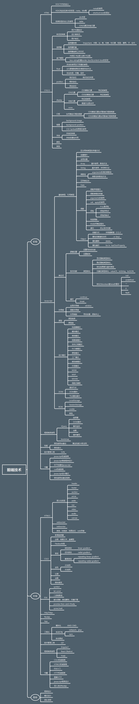

## 换行

### 两个以上的空格在回车进行换行
&copy;  
AT&T

### 插入`<br>`
111<br>xxxx

## 标题
```
# h1
## h2
### h3
#### h4
##### h5
###### h6
```

## 引用

### 嵌套引用
> dxx
>> 1. dsdfsdf
>> 2. sdfsdfl
>>> dsdfsdf


## 列表

### 无序列表 * + - 加一个空格
*   Red
*   Green
*   Blue  

+   Red
+   Green
+   Blue  

-   Red
-   Green
-   Blue  

### 有序列表 数字. 加一个空格
1.  Bird
2.  McHale
3.  Parish 


## 分隔线
————————————————————————————————————————————————
****************
* * *
- - -

## 链接

[123]: http://www.jd.com "jiongdong"

[百度一下](http://www.baidu.com "baiduyixia")

<http://www.taobao.com>

[上京东][123]

## 强调
_一个\_或者\*包裹_  
*一个\_或者\*包裹*

__两个个\_或者\*包裹__  

**两个个\_或者\*包裹**

## 图片

