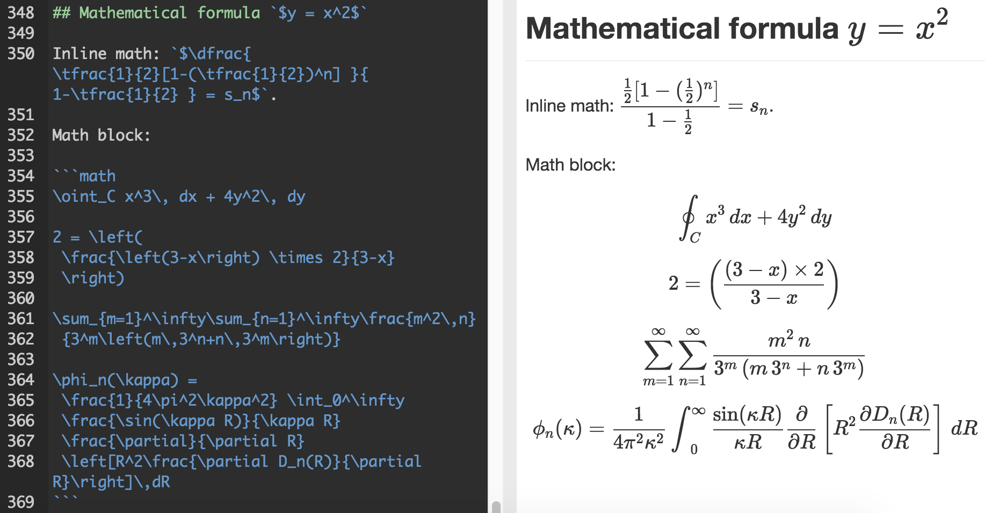
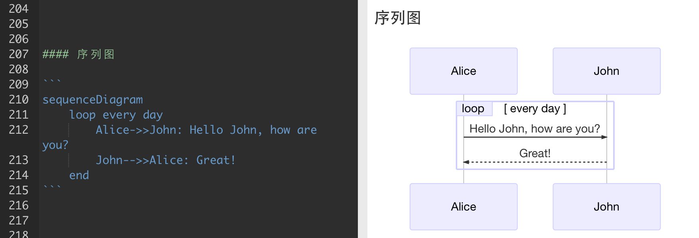

## 认识MarkDown

> Markdown 是一种轻量级标记语言，创始人为约翰·格鲁伯（John Gruber）。它允许人们“使用易读易写的纯文本格式编写文档，然后转换成有效的XHTML(或者HTML)文档”。[4]这种语言吸收了很多在电子邮件中已有的纯文本标记的特性。 --- 维基百科

-  Markdown 是一种轻量级的「标记语言」
- 使用易读易写的纯文本格式编写文档，然后转换成有效的XHTML(或者HTML)文档
- Markdown 的语法十分简单。常用的标记符号也不超过十个，学习成本也不需要太多，且一旦熟悉这种语法规则，会有一劳永逸的效果
- 应用广泛，许多网站与编辑器都支持Markdown，如：Github，Stack Overflow，图灵社区，简书，有道笔记…

## Markdown特点

- 专注你的文字内容而不是排版样式
- 轻松的导出 HTML、PDF 和本身的 .md 文件
- 纯文本内容，兼容所有的文本编辑器与字处理软件
- 可读，直观。适合所有人的写作语言

## 实现原理

1. 通过Markdown语法书写文档
2. 构建为HTML的DOM树
3. 加入定制化的样式

## 语法

- 标题
- 引用
- 斜体
- 粗体
- 换行
- 列表
- 链接
- 分隔线
- 图片
- 代码
- 表格

## 非标准语法

### 代办事项ToDo List

### 甘特图

### 流程图

### 数学公式

### 序列图
