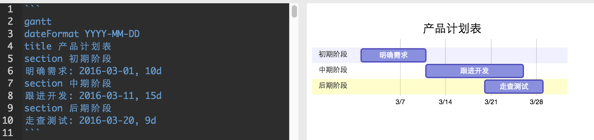
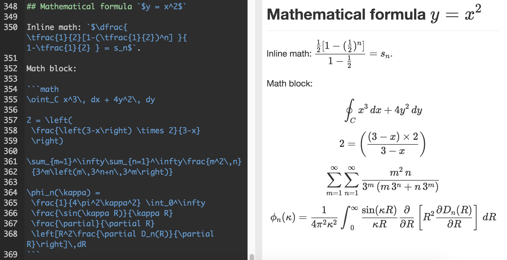
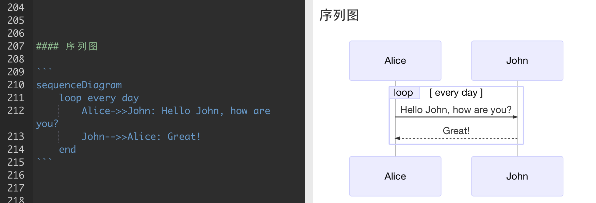

## 什么是Markdown

> Markdown 是一种轻量级标记语言，创始人为约翰·格鲁伯（John Gruber）。它允许人们“使用易读易写的纯文本格式编写文档，然后转换成有效的XHTML(或者HTML)文档”。这种语言吸收了很多在电子邮件中已有的纯文本标记的特性。 --- 维基百科

Markdown是一种轻量级的「标记语言」, 通常为程序员群体所用，目前它已是全球最大的技术分享网站 GitHub 和技术问答网站 StackOverFlow 的御用书写格式。

不要被「标记」、「语言」吓到，Markdown的语法十分简单，常用的标记符号不超过十个，用于日常写作记录绰绰有余，非程序员半小时就能完全掌握。我们做程序的应该十分钟就够了

就是这十个不到的标记符号，却能让人优雅地沉浸式记录，专注内容而不是纠结排版，达到「心中无尘，码字入神」的境界

**总结**
- Markdown 是一种轻量级的「标记语言」
- 使用纯文本格式编写文档，然后转换成HTML文档
- Markdown的常用语法标记符号不超过十个
- 许多网站与编辑器都支持Markdown，如：Github，Stack Overflow，图灵社区，简书，有道笔记…

## Markdown特点

- 专注你的文字内容而不是排版样式
- 轻松的导出 HTML、PDF 和本身的 .md 文件
- 纯文本内容，兼容所有的文本编辑器与字处理软件
- 可读，直观。适合所有人的写作语言

## 实现原理

1. 通过Markdown语法书写文档
2. 构建为HTML的DOM树
3. 加入定制化的样式

## 语法

- 标题
    - `#`
    - `##`
    - `###`
    - `####`
    - `#####`
    - `######`
- 引用
    - `>`
    - `>>`
    - `>>>`
- 斜体
    - `*x*`
    - `_x_`
- 粗体
    - `**x**`
    - `__x__`
- 换行
    - 两个以上的空格在回车进行换行
    - `<br>`
- 列表
    - 无序列表
        - `*-+`加空格开头
    - 有序列表
        - 数组加空格开头
- 链接
    - `[text](url title)`
    - `<url>`
- 分隔线
    - `---`
    - `***`
- 图片
    - ``
- 代码
    - \`\`\`lang\`\`\`
- 表格
    ```
        |列头|列头|列头|
        |:-|:-:|-:|
        |左对齐列|居中对齐列|右对齐列|
    ```

## 非标准语法

### 代办事项ToDo List


### 甘特图


### 流程图


### 数学公式


### 序列图
