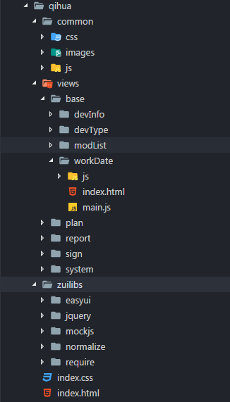

# 企划系统前端单页面应用

### 什么是单页面

传统的多页面应用每个页面（动态页面）都是使用服务器端模板编写，然后请求这个页面的时候由服务器渲染成html再返回

单页面是指只有一个主页面的应用，浏览器一开始要加载所有必须的 html, js, css。所有的页面内容都包含在这个所谓的主页面中。但在写的时候，还是会分开写动态载入页面，然后在交互的时候由动态载入

## 实现方案

前置条件： IE8+, 模块化, 快速开发, AJAX, RESTful API

### 单页面且兼容IE8的框架
- AngularJS 1.2.x
- AvalonJS 1
- RegularJS
- ...

功能完备, 数据驱动视图, 但是学习曲线及学习成本都不适用

### IFrame + Hash/HTML5 history API + Easyui + JQuery + RequireJS + AJAX + RESTful API + mockjs

- IFrame
    > IFRAME是HTML标签，作用是文档中的文档。iframe元素会创建包含另外一个文档的内联框架
- Hash
    > hash可以用来获取或设置页面的标签值。浏览器读取URL后，会自动将hash指定的元素滚动至可视区域
- HTML5 History API 
    > 管理浏览器历史记录的API
- Easyui
    > 基于JQuery的UI插件集合
- JQuery
    > 快速、简洁的JavaScript框架/类库
- RequireJS
    > 基于AMD(异步模块定义)规范的模块载入框架
- AJAX
    > 一种在无需重新加载整个网页的情况下，能够更新部分网页的技术
- RESTful API
    > 通过一套统一的接口, 为AJAX请求提供服务
- mockjs
    > 前端模拟数据， 基于`数据模板`生成模拟数据, 拦截并模拟 ajax 请求

兼容IE8, Easyui+jquery有基础, 可快速开发

## 目录结构



- ./common 公共目录
    - ./js 公共脚本文件
    - ./css 公共样式文件
    - ./images 公共图片
- ./zuilibs 第三方库
    - ./easyui
    - ./jquery
    - ./require
    - ./mockjs
    - ...
- ./views 存放具体的页面
    - ./base 基本数据模块
        - ./workData 工作日历设置界面
            - ./js 工作日历设置界面的脚本文件
            - ./css 工作日历设置界面的样式文件
            - ./index.html 主页面
            - ./main.js 入口JS
        - ./devInfo 设备信息管理
        - ./devType 设备型号管理
        - ...
    - ./plan 主计划计算
    - ./report 统计报表
    - ...

## 技术的使用

### hash&history 

改变地址，不使浏览器发起请求

#### Hash

`location`

包含有关当前 URL 的信息

```js
location.hash = 'a';

window.onhashchange = function(evt) {
    console.dir(evt);
}
```

#### history

##### history.pushState & history.replaceState

```js
/**
*@data {object} state对象，这是一个javascript对象，一般是JSON格式的对象字面量。
*@title {string} 可以理解为document.title，在这里是作为新页面传入参数的。
*@url {string} 增加或改变的记录，对应的url，可以是相对路径或者绝对路径，url的具体格式可以自定。
*/
history.pushState(data, title, url) //向浏览器历史栈中增加一条记录。
history.replaceState(data, title, url) //替换历史栈中的当前记录。

window.onpopstate = function(e) {
    console.dir(e.state);
};
```

### RequireJS

RequireJS 是一个JavaScript模块加载器。它非常适合在浏览器中使用, 使用RequireJS加载模块化脚本将提高代码的加载速度和质量。

#### RequireJS的优点
- 异步加载
    > 我们知道，通常网站都会把script脚本的放在html的最后，这样就可以避免浏览器执行js带来的页面阻塞。使用RequireJS，会在相关的js加载后执行回调函数，这个过程是异步的，所以它不会阻塞页面。

- 按需加载
    > 通过RequireJS，你可以在需要加载js逻辑的时候再加载对应的js模块，这样避免了在初始化网页的时候发生大量的请求和数据传输，或许对于一些人来说，某些模块可能他根本就不需要，那就显得没有必要。

- 方便的模块依赖管理
    > 解决因为script标签顺序问题而导致依赖关系发生错误：这个函数未定义，那个变量undefine之类的。通过RequireJS的机制，你能确保在所有的依赖模块都加载以后再执行相关的文件，所以可以起到依赖管理的作用。

### 基于JQuery的AJAX

#### AJAX
AJAX的全称是Asynchronous JavaScript and XML（异步的 JavaScript 和 XML）  

ajax是一种在无需重新加载整个网页的情况下，能够更新部分网页的技术。   

通过与服务器进行少量数据交换。ajax可以使网页实现异步更新。这意味着可以在不重新加载整个网页的情况下，对网页的某部分进行更新。而传统的网页（不使用ajax）如果需要更新内容，必须重载整个网页面。

ajax的优点：
1. 最大的一点是页面无刷新，用户的体验非常好。
2. 使用异步方式与服务器通信，具有更加迅速的响应能力。。
3. 可以把一些服务器负担的工作转嫁到客户端，利用客户端闲置的能力来处理，减轻服务器压力
4. 基于标准化的并被广泛支持的技术，不需要下载插件或者小程序。
5. ajax可使因特网应用程序更小、更快，更友好。

ajax的缺点：
1. ajax不支持浏览器back按钮
2. AJAX暴露了与服务器交互的细节

#### jQuery.ajax
```js
$.ajax({
    url: '/test.action', // 请求的路径
    method: 'GET', // 请求类型/请求方法
    type: 'GET', // method的别名
    data: null, // 发送到服务器的数据
    processData: true, // 是否转换通过data选项传递进来的数据，如果是一个对象，都会处理转化成一个查询字符串

    async: true, // 异步请求/同步请求
    cache: false, // 是否启用浏览器缓存
    contentType: 'aplication/x-www-form-urlencoded;charset=UTF-8', // 发送信息的内容编码类型
    context: null, // 设置 Ajax 相关回调函数的上下文
    global: false, // 是否触发全局 AJAX 事件。默认值: true。设置为 false 将不会触发全局 AJAX 事件，如 ajaxStart 或 ajaxStop 可用于控制不同的 Ajax 事件
    ifModified: false, // 在服务器数据改变时获取新数据
    timeout: 0, // 设置超时时间，0代表没有超时

    dataType: 'json', // 期望从服务器返回的数据类型， xml/html/script/json/jsonp/text
    jsonp: '', // 在JSONP请求中覆盖回调函数名
    jsonpCallback: '', // 为 jsonp 请求指定一个回调函数名, 不用指定，jquery会自动把jsonp的数据取出来传递给success方法
    dataFilter: function(data, type){

    }, // 给 Ajax 返回的原始数据的进行预处理的函数。data 是 Ajax 返回的原始数据，type 是调用 jQuery.ajax 时提供的 dataType 参数。函数返回的值将由 jQuery 进一步处理
    beforeSend: function(jqXHR, settings) {

    }, // 发送请求前的回调函数，return false 取消请求
    success: function(data, statusText, jqXHR) {

    }, // 请求成功回调
    error: function(jqXHR, statusText, errorThrown) {

    }, // 请求失败回调
    complete: function(jqXHR, statusText) {

    } // 请求完成回调
});
```

#### 衍生方法
```js
$.get(url, data, success, dataType);

// ==

$.ajax({
    url: url,
    type: 'GET',
    data: data,
    success: success,
    dataType: dataType
});
```

```js
$.getJSON(url, data, success);

$.getScript(url, success);

$.post(url, data, success, dataType);
```

### mockjs

1. 前后端分离

    让前端攻城师独立于后端进行开发
2. 增加单元测试的真实性

    通过随机数据，模拟各种场景
3. 开发无侵入
    
    不需要修改既有代码，就可以拦截 Ajax 请求，返回模拟的响应数据
4. 用法简单
    
    符合直觉的接口
5. 数据类型丰富
    
    支持生成随机的文本、数字、布尔值、日期、邮箱、链接、图片、颜色等

#### 数据模板定义规范

每个属性由 3 部分构成：属性名、生成规则、属性值：`'name|rule': value`

规则 有 7 种格式：
```
'name|min-max': value
'name|count': value
'name|min-max.dmin-dmax': value
'name|min-max.dcount': value
'name|count.dmin-dmax': value
'name|count.dcount': value
'name|+step': value
```

##### String

1. 'name|min-max': string

    通过重复 string 生成一个字符串，重复次数大于等于 min，小于等于 max

2. 'name|count': string

    通过重复 string 生成一个字符串，重复次数等于 count

```js
{
    'name|0-10': 'hcx',
    'user|5': 'hcx'
}
```

##### Number

1. 'name|+1': number
    
    属性值自动加 1，初始值为 number

2. 'name|min-max': number

    生成一个大于等于 min、小于等于 max 的整数，属性值 number 只是用来确定类型

3. 'name|min-max.dmin-dmax': number

    生成一个浮点数，整数部分大于等于 min、小于等于 max，小数部分保留 dmin 到 dmax 位

```js
{
    'number1|1-100.1-10': 1,
    'number2|123.1-10': 1,
    'number3|123.3': 1,
    'number4|123.10': 1.123
}
```

##### Boolean

1. 'name|1': boolean

    随机生成一个布尔值，值为 true 的概率是 1/2，值为 false 的概率同样是 1/2

2. 'name|min-max': value

    随机生成一个布尔值，值为 value 的概率是 min / (min + max)，值为 !value 的概率是 max / (min + max)

```js
{
    'enabled|1': true,
    'disabled|1-4': false
}
```

##### Object

1. 'name|count': object

    从属性值 object 中随机选取 count 个属性

2. 'name|min-max': object

    从属性值 object 中随机选取 min 到 max 个属性

```js
{
    'user|2': {
        name: 'hcxowe',
        age: '12',
        other: 'handlesome',
        cash: 120000000,
        sfef: 'abcdefg'
    },
    'user1|1-4': {
        name: 'hcxowe',
        age: '12',
        other: 'handlesome',
        cash: 120000000,
        sfef: 'abcdefg'
    }
}
```

##### Array

1. 'name|1': array

    从属性值 array 中随机选取 1 个元素，作为最终值

2. 'name|+1': array

    从属性值 array 中顺序选取 1 个元素，作为最终值

3. 'name|min-max': array

    通过重复属性值 array 生成一个新数组，重复次数大于等于 min，小于等于 max

4. 'name|count': array

    通过重复属性值 array 生成一个新数组，重复次数为 count

```js
{
    'user1|1': [123, 'hcx'],
    'name|1-2': ['hcx', 'owe', 'rng', 'we'],
    'name|2': ['hcx', 'owe', 'rng', 'we']
}
```


##### Function

1. 'name': function

    执行函数 function，取其返回值作为最终的属性值，函数的上下文为属性 'name' 所在的对象

```js
{
    'name': function() {
        return this.user[Math.floor(Math.random(4))];
    },
    'user': ['we', 'rng', 'skt', 'lz']
}
```


##### RegExp

1. 'name': regexp

    根据正则表达式 regexp 反向生成可以匹配它的字符串。用于生成自定义格式的字符串

```js
{
    'regexp1': /[a-z][A-Z][0-9]/,
    'regexp2': /\w\W\s\S\d\D/,
    'regexp3': /\d{5,10}/
}
```

#### 数据占位符定义规范

占位符 只是在属性值字符串中占个位置，并不出现在最终的属性值中

```
@占位符
@占位符(参数 [, 参数])
```

- 用 @ 来标识其后的字符串是 占位符
- 占位符 引用的是 Mock.Random 中的方法
- 通过 Mock.Random.extend() 来扩展自定义占位符
- 占位符 也可以引用 数据模板 中的属性
- 占位符 会优先引用 数据模板 中的属性
- 占位符 支持 相对路径 和 绝对路径

```js
{
    first: '@FIRST',
    middle: '@FIRST',
    last: '@LAST',
    full: '@first @middle @last'
}
```

#### Mock.Random

Mock.Random 是一个工具类，用于生成各种随机数据

Mock.Random 的方法在数据模板中称为『占位符』，书写格式为 @占位符(参数 [, 参数])

```js
var Random = Mock.Random
Random.email()
// => "n.clark@miller.io"
Mock.mock('@email')
// => "y.lee@lewis.org"
Mock.mock( { email: '@email' } )
// => { email: "v.lewis@hall.gov" }
```

|Type           |Method|
|:-             |:-|
|Basic          |boolean, natural, integer, float, character, string, range, date, time, datetime, now
Image           |image, dataImage
Color           |color
Text            |paragraph, sentence, word, title, cparagraph, csentence, cword, ctitle
Name            |first, last, name, cfirst, clast, cname
Web             |url, domain, email, ip, tld
Address         |	area, region
Helper          |capitalize, upper, lower, pick, shuffle
Miscellaneous   |guid, id


##### 扩展

Mock.Random 中的方法与数据模板的 @占位符 一一对应，在需要时还可以为 Mock.Random 扩展方法，然后在数据模板中通过 @扩展方法 引用

```js
Random.extend({
    constellation: function(index) {
        var constellations = ['白羊座', '金牛座', '双子座', '巨蟹座', '狮子座', '处女座', '天秤座', '天蝎座', '射手座', '摩羯座', '水瓶座', '双鱼座']
        return typeof index === 'number' ? constellation[index] : this.pick(constellations)
    }
});
Random.constellation(1); // 金牛座
Mock.mock('@CONSTELLATION')
Mock.mock({
    constellation: '@CONSTELLATION'
});
```

#### Mock.mock()

`Mock.mock( rurl?, rtype?, template|function( options ) )`

`rurl` 
可选, 表示需要拦截的 URL，可以是 URL 字符串或 URL 正则。例如 `/\/domain\/list\.json/、'/domian/list.json'`

`rtype`

可选, 表示需要拦截的 Ajax 请求类型。例如 `GET、POST、PUT、DELETE` 等。

`template`

可选, 表示数据模板，可以是对象或字符串。例如 `{ 'data|1-10':[{}] }、'@EMAIL'`

`function(options)`

可选, 表示用于生成响应数据的函数。

`options`

指向本次请求的 Ajax 选项集，含有 url、type 和 body 三个属性